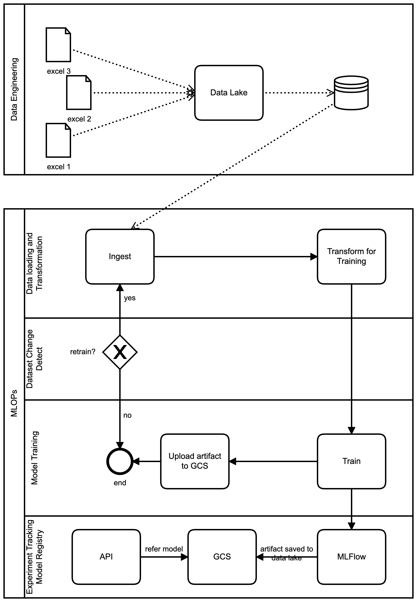
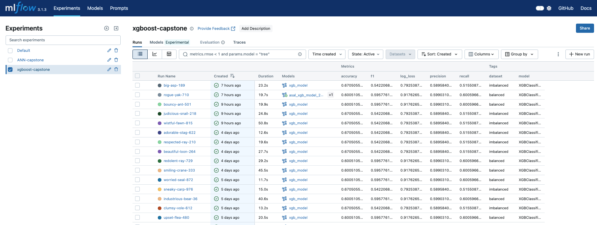
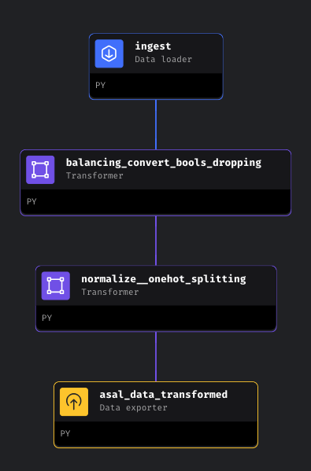
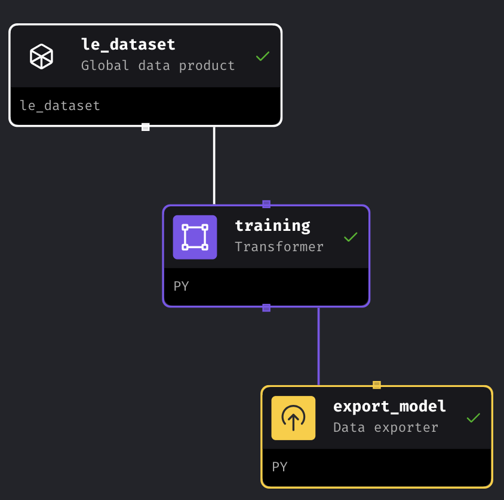
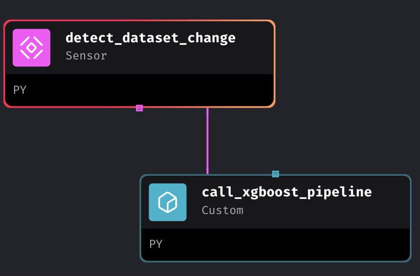
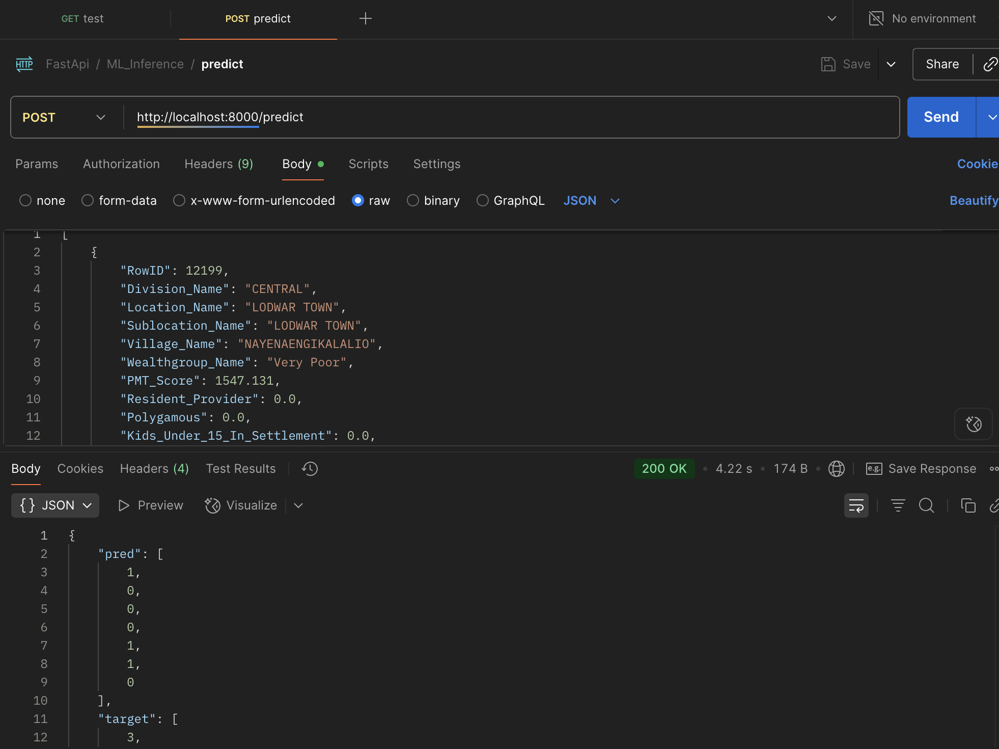
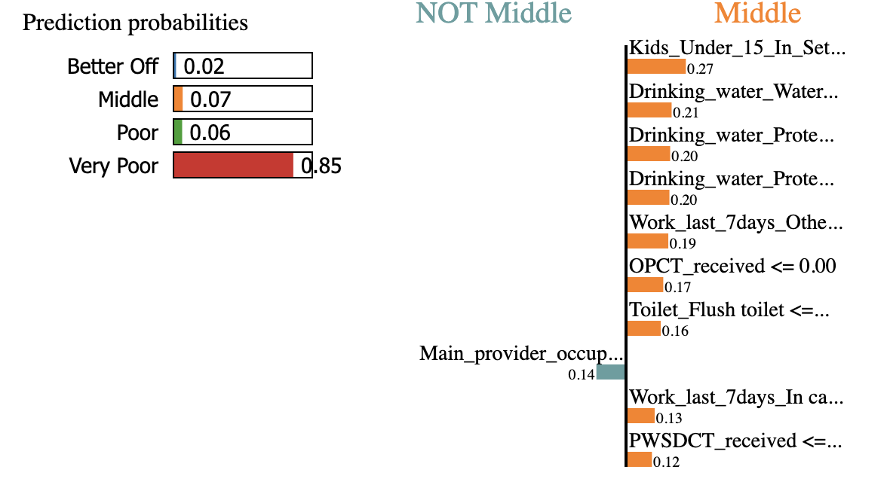
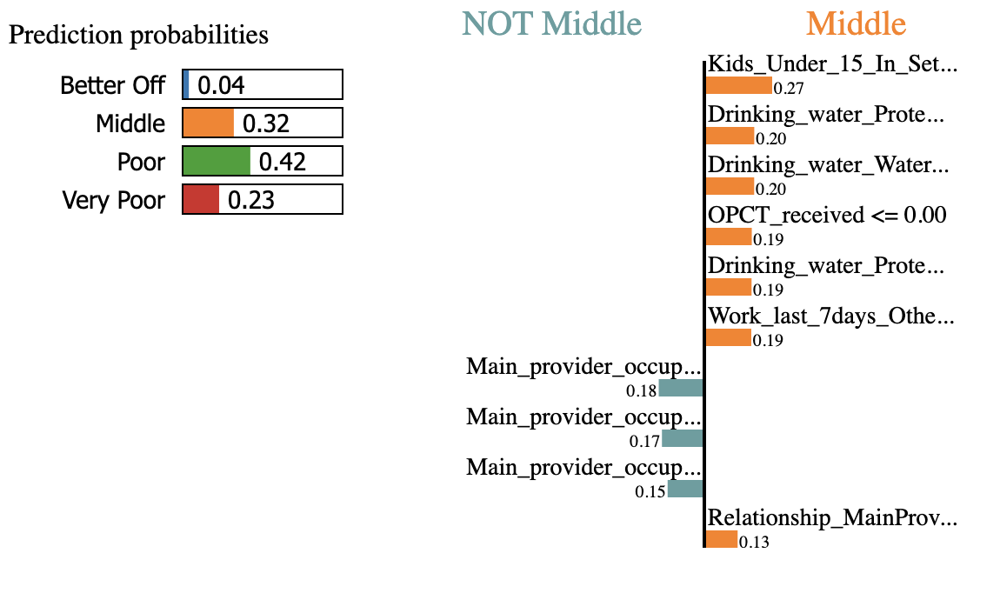
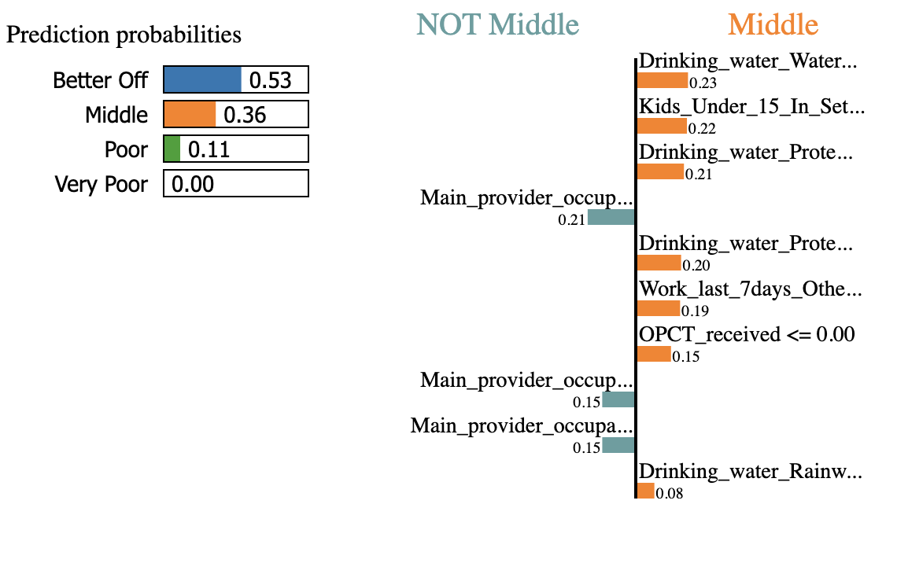
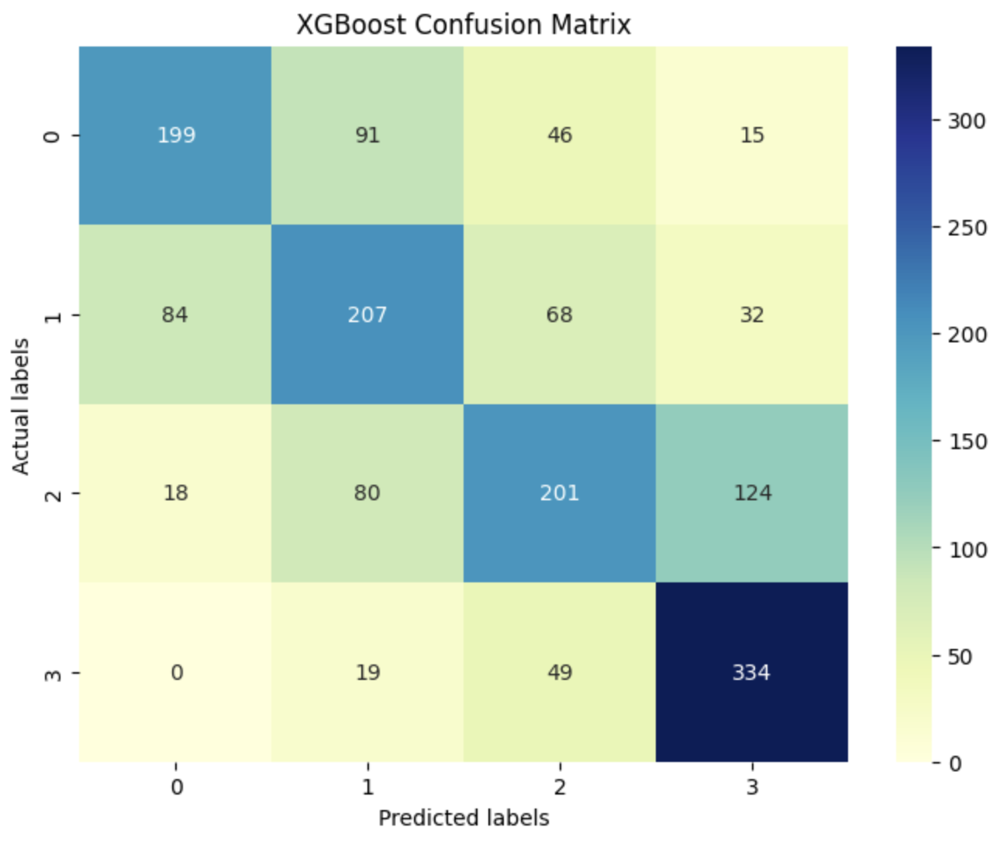

# Household Classification for Social Protection

### Table of contents

<!-- - [Household Classification for Social Protection](#household-classification-for-social-protection) -->
- [Household Classification for Social Protection](#household-classification-for-social-protection)
    - [Table of contents](#table-of-contents)
    - [Introduction](#introduction)
    - [Problem Statement](#problem-statement)
  - [Objective](#objective)
    - [Data Sources](#data-sources)
      - [Data (Schema)](#data-schema)
    - [Technologies](#technologies)
  - [Reproducability](#reproducability)
  - [Workflow](#workflow)
    - [Setup](#setup)
    - [MLFlow (Experiment Tracking and Model registrar)](#mlflow-experiment-tracking-and-model-registrar)
    - [Run MageAI](#run-mageai)
    - [Go Live!](#go-live)
  - [Explainability](#explainability)
  - [Conclusion](#conclusion)
  - [Acknowledgment](#acknowledgment)

---
---

### Introduction
We'll be looking to develop a classification model to aide in providing humanitarian aide in Arid and Semi-Arid (ASAL) regions all-over the world, through targeting affected households and providing relief (either cash on in-Kind). The model will be built upon pre-existing works [PROSPERA - Mexico](https://www.developmentpathways.co.uk/blog/the-demise-of-mexicos-prospera-programme-a-tragedy-foretold/), [HSNP - Kenya](https://ndma.go.ke/hunger-safety-net-programme-hsnp/), using data-sets already develeped using Proxy Means Testing

We'll be using data from HSNP (Kenya), building a classification model and operationalizing it using learnings from [MLOPs Zoomcamp](https://github.com/DataTalksClub/mlops-zoomcamp/tree/main)

The [reference notebook](./ANN%20HH%20Scorer.ipynb) in this repo can be used for visibility into the working code. We can also setup the various tools as described in the [reproducability](#reproducability) and [workflow](#workflow) sections

### Problem Statement
Create a production-ready classification model for easy household targeting using MLOPs methodologies

## Objective
Use Machine Learning Operations (MLOPs) methodologies to operationalize household classification model. 

The model classifies data into 4 classes representing economic tiers i.e. better off, middle, poor, very poor

Some interesting insights will be:
1. Feature engineering and analysis
2. Accuracy metrics from model building using MlFlow (during training)
3. model metrics using various visibility libbraries i.e. lime explainability

### Data Sources
The anonymized data can be requested via the [hsnp website](https://www.hsnp.or.ke) -> data-form page

Data used in this project is accessible from github via [this link](https://raw.githubusercontent.com/dakn2005/ASAL-Households-Classification-for-Social-Protection/refs/heads/main/data/output-refined-ann.csv?raw=True)
#### Data (Schema)
The data contains the fields below:
```
  RowID
  Division_Name
  Location_Name
  Sublocation_Name
  Village_Name
  Wealthgroup_Name
  PMT_Score
  Resident_Provider
  Polygamous
  Kids_Under_15_In_Settlement
  Children_Under_15_outside_settlement
  Spouses_on_settlement
  Spouses_Outside_HH
  IsBeneficiaryHH
  recipient_of_wfp
  recipient_of_hsnp
  OPCT_received
  PWSDCT_received
  Relationship_MainProvider
  Gender
  Age
  School_meal_receive
  Work_last_7days
  Main_provider_occupation
  Toilet
  Drinking_water
  Donkeys_owned
  Camels_owned
  Zebu_cattle_owned
  Shoats_owned
  Nets_owned
  Hooks_owned
  Boats_rafts_owned
```

### Technologies
- Docker (containerization)
- Terraform (infrastructure as code) - decided on using Terraform for tools uniformity
- Mage
- Google Cloud Storage (data lake) - for model and data storage
- MLFlow
- Evidently
- FastAPI
- Postgres

## Reproducability

<details>
<summary>Makefile</summary>
Using the makefile, we're able to organize and centralize commands for manageability. The project makefile provisions the mlops tools for infra, training, and web deployment

</details>

<details>
<summary>GCP Setup</summary>

- Follow the GCP instructions in setting up a project

- We set up a service account to aide Terraform/Other infrastructure tool in accessing the GCP platform.

- Configure the GCP service account by accessing I&M and Admin -> service accounts -> create service account. Add the required roles (Bigquery Admin, Compute Admin and Storage Admin)

- To get the service account key, click on the dropdown -> manage keys -> create key (choose JSON). This downloads the key to be used in Kestra to setup Bigquery db and Bucket in this instance

</details>

<details>
<summary>Mage AI Setup</summary>
Go to (my-mage-docker-quickstart)(https://github.com/dakn2005/my-mage-docker-quickstart). 
Run the start.sh script with the below command

```
./start.sh
```

</details>

<details>
<summary>Infrastracture setup with Terraform</summary>

> Instead of using Terraform for this assignment, I preferred using a singular tool for the Infrastracture setup

Setup Terraform with the format below. Ensure that the variables are filled in a variables.tf file

```
terraform {
  required_providers {
    google = {
      source  = "hashicorp/google"
      version = "6.18.0"
    }
  }
}

provider "google" {
  # Configuration options
  # in the terminal export google credentials with your path to the key
  project = "[your-project-name]"
  region  = "[region e.g. us-central1]"
}

resource "google_storage_bucket" "de-bucket" {
  name          = var.gcs_bucket_name
  location      = var.location
  force_destroy = true

  lifecycle_rule {
    condition {
      age = 1
    }
    action {
      type = "AbortIncompleteMultipartUpload"
    }
  }
}

resource "google_bigquery_dataset" "de-dataset" {
  dataset_id = var.bq_dataset_name
  location = var.location
}
```

> ensure to set GCP Credentials - the downloaded json key file from GCP setup
> Go to Kestra -> Namespaces -> your namespace -> KV Store -> New Key-Value -> set the GCP_CREDS key (select JSON) -> copy-paste the json key


</details>


## Workflow

### Setup
Using the make file, setup the infrastructure using the command below. This will create and provision the GCP bucket for data storage, and also artifact files from mlflow
Using the Makefile, run the below command

```
make terraform
```

This runs the commands

```
terraform init
terraform apply
```

You can view the proposed terraform plan using <kbd>terraform plan</kbd> command, below applying for infrastructure provisioning

### MLFlow (Experiment Tracking and Model registrar)
Using the command below, ensure mlflow is running. This will track experiments, model performance, and store artifacts e.g. saved model, performance artifacts e.g. confusion matrix

```
make mlflow-serve
```

On successful run, the following image will appear. 



To capture metrics,  call the mlflow client in the model training code.

- set the tracking id
```
mlflow.set_tracking_uri(MLFLOW_TRACKING_URI)
```
- Perform experiment tracking

```
with mlflow.start_run():
    mlflow.set_tag("model", clf.__class__.__name__)
  
    mlflow.set_tag('cols', X_train.columns.tolist())
    mlflow.log_params(clf.get_params())
    mlflow.log_metrics({"accuracy": accuracy, "precision": precision, "recall": recall, "f1": f1, "log_loss": log_loss_value})
    mlflow.log_artifact('xgb_cm_plot.png')
    mlflow.log_artifact('col_set.json')
    mlflow.xgboost.log_model(clf, "xgb_model")
```

- Model Registry
```
client = MlflowClient(tracking_uri=MLFLOW_TRACKING_URI)

# XGBoost
runs = client.search_runs(
    experiment_ids='[experiment id]',
    filter_string="metrics.accuracy > .6 and metrics.recall > .6",
    run_view_type=ViewType.ACTIVE_ONLY,
    max_results=5,
    order_by=["attributes.start_time desc"]
)

for run in runs:
    print("Run ID: {}, f1: {}".format(run.info.run_id, run.data.metrics['f1']))
```

- register an identified model
```
model_name = "asal_xgb_model_20250804_3"

run_id = [run id]

model_uri = f"runs:/{run_id}/[logged model]"
mlflow.register_model(model_uri=model_uri, name=model_name)
```

### Run MageAI
After mlflow is running, use the below command to run MageAI (ensure the mage folder was downloaded as per the instructions under [reproducability](#reproducability))

```
make mageai-start
```

This will activate the Machine learning pipelines for training of the model. Results are tracked by mlflow, and model are saved in a GCS bucket. 

In mage we have the following pipelines:
- Data preparation



- XGBoost training



- Retraining



- Logging via [mlflow](#mlflow-experiment-tracking-and-model-registrar)


### Go Live!
Run the make command to execute a web-service built with FastAPI and containerized in docker. The command run <kbd>docker compose up</kbd> command in the chosen infrastructure (EC2, Linode etc) 

```
make web-api-start
```

Once the docker container is running, we are able to make a prediction, like the postman screenshot shown



## Explainability
Using Local interpretable model-agnostic explanations (LIME), we are able to glimpse prediction at a single record level





We also track performance using confusion matrix, and saving this artifact per training (experiment)



## Conclusion
The model had moderate performance with accuracy, precision and recall of 0.6. We'ld need to enhance the training with more data-points (a larger dataset)

One issue could be the reduced dataset after performing undersampling to ensure equal representation across the classes, and one way to mitigate this is having a much larger dataset, and running the retrain operation

## Acknowledgment
This project was made possible thanks to:
- DataTalks.Club for the excellent MLOps Zoomcamp course facilitated Alexey Grigorev and the course instructors 
- MLOps Zoomcamp community for support, discussions, and shared learning experiences
